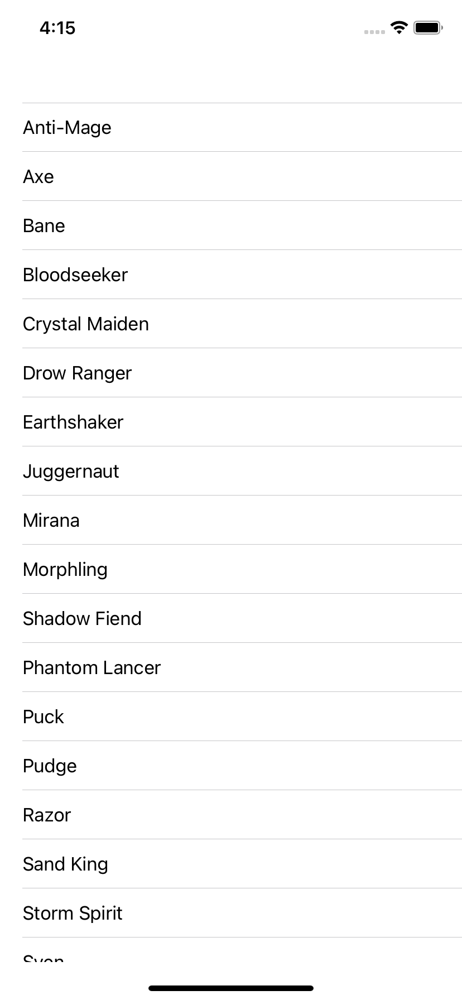
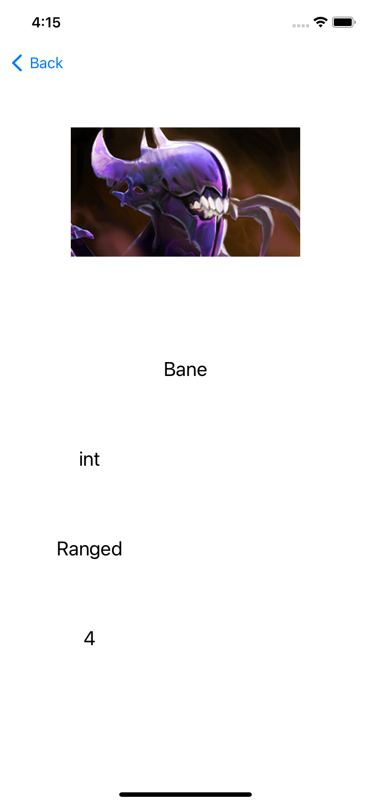
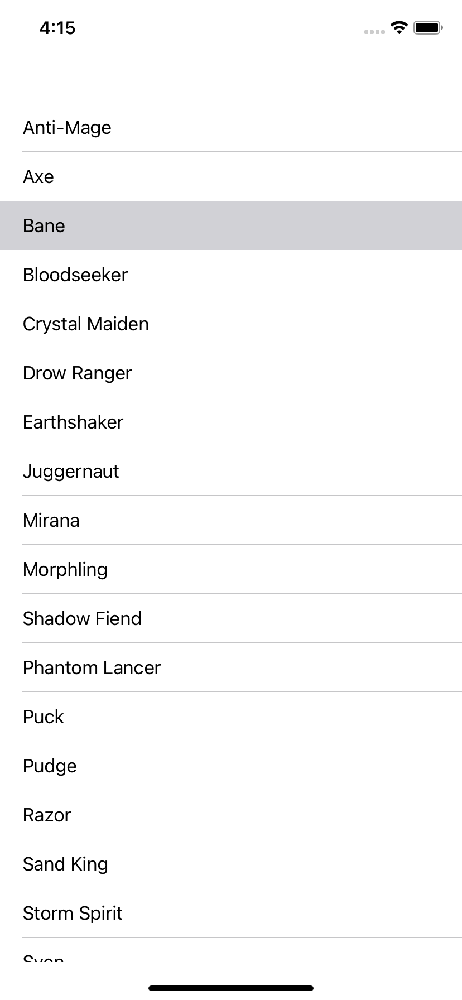

# JSON Data fetching and displaying each data in a separate VeiwController

# App Preview

# Screenshots

## This is how app looks like initially...

## When a data is selected, it is passed on to a new View Controller where the data is displayed for that row

## When we press Back and we see the row is highlighted which we clicked last to view the data in a separate Veiw Controller

# How to clone this ToDo App?
## git clone https://github.com/the-hsr/json-data.git
## If first time user then you might be asked to configure the user in git(P.S google it, it's simple)
## After cloning just run it (for MacOS command+R)
